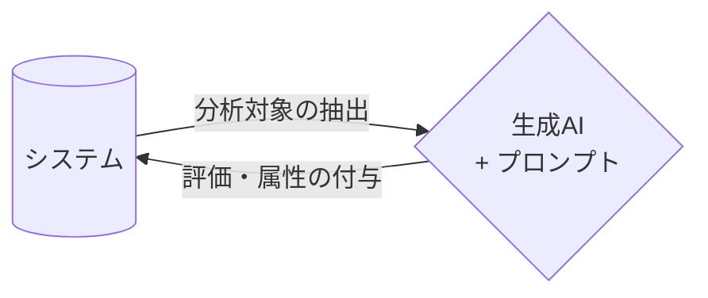
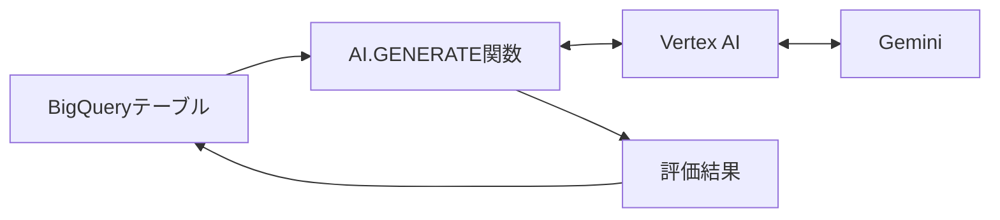

# BigQuery AI.GENERATE関数でDBのレコードを生成AIで評価

## 発表アウトライン（技術的裏取り済み）

---

## 📋 発表の目的とターゲット

**ターゲット聴衆**：
- システムで出力された全レコードに対してGeminiで評価・ラベリングしたい人
- データパイプラインに生成AIを組み込みたいエンジニア
- BigQueryを使ったデータ基盤を運用している人

**メッセージ**：
「テキスト生成・画像生成の次は、システムのレコード評価・分類です」

---

## 🎯 スライド構成（全12枚）

### 1. カバースライド
**タイトル**：BigQuery AI.GENERATE関数でDBのレコードを生成AIで評価

---

### 2. 課題提起：システムレコードの評価ニーズ
**タイトル**：こんなニーズありませんか？

**内容**：
- システムから流れてくる大量のレコード
- 全レコードに対してGeminiで評価したい
- 例：
  - カスタマーレビューの感情分析
  - テキストから特定の情報を抽出する。
  - テキストデータの自動分類・ラベリング

**イメージ**



---

### 3. 解決策：BigQuery AI.GENERATE関数とは
**タイトル**：BigQueryからVertex AI経由でGemini呼び出し

**仕組み**：


**特徴**：
1. **SQLだけで完結**：外部連携不要
2. **Row-wise処理**：1レコードごとに評価
3. **型指定可能**：output_schemaで構造化
4. **スケーラブル**：BigQueryの分散処理

**技術的根拠**：
```sql
with
    base as (
        select
            text_column,
            ai.generate(
                'レビューから感情スコアと評価を理由を分析して' ||
                 text_column,
                output_schema => 'score INT64, reason STRING'
            ) as ai_res
        from reviews
    )

select text_column, ai_res.score, ai_res.reason
from base
```
| text_column (元のレビュー文)                                 | score (感情スコア) | reason (理由)                                                |
| ------------------------------------------------------------ | ------------------ | ------------------------------------------------------------ |
| 「デザインが非常に洗練されていて、リビングに置くだけで雰囲気が良くなりました。ただ、初期設定に少し時間がかかったのが残念です。」 | 80                 | デザインについては非常に高く評価されていますが、セットアップの難易度がマイナス要因として指摘されています。 |
| 「注文してから届くまでが遅すぎます。さらに、届いた商品の箱が潰れていました。中身は無事でしたが、二度と利用しません。」 | 15                 | 配送の遅延と梱包の状態に対する強い不満が示されており、リピート意向も低いため低スコアと判断されました。 |
| 「コスパ最高です！この価格でこの機能性は文句なし。操作も直感的で、機械が苦手な私でもすぐに使いこなせました。」 | 95                 | 価格、機能性、操作性のすべてにおいて満足度が高く、ポジティブな表現が多用されているため高評価です。 |
---

### 4. 関数の種類と使い分け
**タイトル**：GENERATE関数ファミリーの整理

| 関数名 | 処理単位 | 用途 | 特徴 |
|--------|----------|------|------|
| **AI.GENERATE** | Row-wise（単一行） | 1レコードごとの評価 | **output_schema指定可能** |
| AI.GENERATE_TEXT | Table-valued（複数行） | テーブル全体の処理 | 簡潔な出力列名 |
| ML.GENERATE_TEXT | Table-valued（複数行） | 旧式 | AI.GENERATE_TEXT推奨 |

**重要なポイント**：
- **AI.GENERATE**：output_schemaでSTRUCT、ARRAY含む複雑な型を定義可能
- **従来のML.GENERATE_TEXT**：出力列の型が固定

**技術的根拠**：
- AI.GENERATE_TEXTが新しい推奨版（ドキュメント確認済み）
- output_schemaでSTRING、INT64、FLOAT64、BOOL、ARRAY、STRUCTをサポート

---

### 5. output_schemaの威力
**タイトル**：構造化された評価結果を得る

**従来（ML.GENERATE_TEXT）**：
- 出力は固定のJSON
- 型が不確定

**新しい（AI.GENERATE）**：
```sql
SELECT
  record_id,
  AI.GENERATE(
    'このレビューを評価してください',
    review_text,
    STRUCT(
      'sentiment STRING, score INT64, category ARRAY<STRING>'
      AS output_schema
    )
  ) AS evaluation
FROM customer_reviews
```

**結果**：
- sentiment: "positive"
- score: 85
- category: ["product", "service"]

**技術的根拠**：
- output_schemaでカスタムスキーマ定義可能（公式ドキュメント確認済み）

---

### 6. 実践例1：レビューの自動評価
**タイトル**：全レコードに感情分析スコアを付与

```sql
CREATE OR REPLACE TABLE analyzed_reviews AS
SELECT
  review_id,
  review_text,
  AI.GENERATE(
    'このレビューの感情を分析してください',
    review_text,
    STRUCT(
      'sentiment STRING, confidence_score FLOAT64,
       key_points ARRAY<STRING>' AS output_schema,
      'gemini-2.5-flash' AS model
    )
  ).result.* -- 構造化結果を展開
FROM customer_reviews
WHERE analyzed_at IS NULL; -- 未分析のみ
```

**ポイント**：
- 1レコードごとにGeminiが評価
- 構造化された結果（sentiment、スコア、キーポイント）
- 未分析レコードのみ処理（増分更新）

---

### 7. 実践例2：ログデータの異常検知
**タイトル**：システムログを自動分類

```sql
SELECT
  log_id,
  log_message,
  AI.GENERATE(
    'このログは正常/警告/エラーのどれですか？',
    log_message,
    STRUCT(
      'category STRING, severity INT64,
       requires_action BOOL' AS output_schema
    )
  ).result AS classification
FROM system_logs
WHERE created_at > TIMESTAMP_SUB(CURRENT_TIMESTAMP(), INTERVAL 1 HOUR)
```

**結果**：
- category: "error"
- severity: 8
- requires_action: true

---

### 8. dbtでの増分更新パターン
**タイトル**：再実行を防ぐ運用ノウハウ

**課題**：
- AI.GENERATEはコストがかかる
- 既に評価済みのレコードは再実行したくない

**解決策：dbt増分モデル**

```sql
{{
  config(
    materialized='incremental',
    unique_key='record_id'
  )
}}

SELECT
  record_id,
  created_at,
  AI.GENERATE(...) AS evaluation
FROM {{ source('raw', 'records') }}


  WHERE record_id NOT IN (
    SELECT record_id FROM {{ this }}
  )

```

**ポイント**：
- 増分更新で未処理レコードのみ実行
- コスト削減
- システム組み込みに最適

---

### 9. 管理型AI関数との組み合わせ
**タイトル**：さらに高度な評価も可能

BigQueryには他にも管理型AI関数があります：

- **AI.CLASSIFY**：ユーザー定義カテゴリに分類
- **AI.SCORE**：品質や類似度でランク付け
- **AI.IF**：自然言語条件でフィルタリング

**組み合わせ例**：
```sql
SELECT
  record_id,
  AI.SCORE('品質スコア', description) AS quality,
  AI.CLASSIFY(['重要', '通常', '低優先'], content) AS priority
FROM records
```

**技術的根拠**：
- プロンプト最適化とパラメータ自動選択済み（公式ドキュメント確認済み）

---

### 10. システム組み込みのベストプラクティス
**タイトル**：本番運用のポイント

**コスト管理**：
- 増分更新で再実行を防ぐ
- WHERE句で対象を絞る
- Provisioned Throughputで安定化

**品質管理**：
- output_schemaで構造化
- confidenceスコアで精度確認
- 定期的なプロンプト見直し

**運用管理**：
- dbtでパイプライン化
- ステージング→評価→検証の3段階
- エラーハンドリング（status列をチェック）

---

### 11. 他手法との比較
**タイトル**：なぜBigQuery AI.GENERATEなのか？

| 手法 | データ移動 | 型指定 | システム組み込み | 総合評価 |
|------|----------|--------|----------------|----------|
| **BigQuery AI.GENERATE** | 不要 | ◎ | ◎ | **◎推奨** |
| Cloud Functions + API | 必要 | △ | ◯ | ◯ |
| Dataflow + Vertex AI | 必要 | ◯ | ◯ | ◯ |
| 外部バッチ処理 | 必要 | △ | △ | △ |

**選択ガイド**：
- データ基盤がBigQuery → **AI.GENERATE**
- 複雑なカスタム処理 → Cloud Functions
- リアルタイム処理 → Vertex AI直接

---

### 12. まとめ：次のステップへ
**タイトル**：システム規模の評価・分類の時代

**メリット**：
- SQLだけで全レコード評価可能
- データ移動なしでセキュア
- 型指定で後続処理が容易
- dbtで運用効率化

**次のステップ**：
- テキスト生成・画像生成の次は**レコード評価**
- システムに組み込む生成AI活用
- データ基盤での自動化・効率化

**呼びかけ**：
「BigQuery AI.GENERATE、使ってみませんか？」

---

## 🔍 技術的裏取り完了項目

✅ AI.GENERATE関数のoutput_schema仕様（公式ドキュメント確認）
✅ Row-wise処理の詳細（各行に対してSTRUCT値を返す）
✅ Vertex AI統合の仕組み（BigQueryからVertex AIエンドポイントへのリクエスト）
✅ ML.GENERATE_TEXT vs AI.GENERATE_TEXTの違い（AI.GENERATE_TEXTが推奨版）
✅ システム組み込みのユースケース（Provisioned Throughput、管理型AI関数）

---

## 📚 参考資料

- [AI.GENERATE function](https://docs.cloud.google.com/bigquery/docs/reference/standard-sql/bigqueryml-syntax-ai-generate)
- [ML.GENERATE_TEXT function](https://docs.cloud.google.com/bigquery/docs/reference/standard-sql/bigqueryml-syntax-generate-text)
- [Generative AI overview](https://docs.cloud.google.com/bigquery/docs/generative-ai-overview)
- [AI.GENERATE_TEXT function](https://docs.cloud.google.com/bigquery/docs/reference/standard-sql/bigqueryml-syntax-ai-generate-text)

---

## 🎨 スライドデザイン方針

- **カラーテーマ**: Kanagawa Wave（既存維持）
- **フォントサイズ**: 本文26px、タイトル40px（既存維持）
- **レイアウト**: コード例は見やすく、表は比較しやすく
- **強調**: システム組み込み、output_schema、増分更新をハイライト
