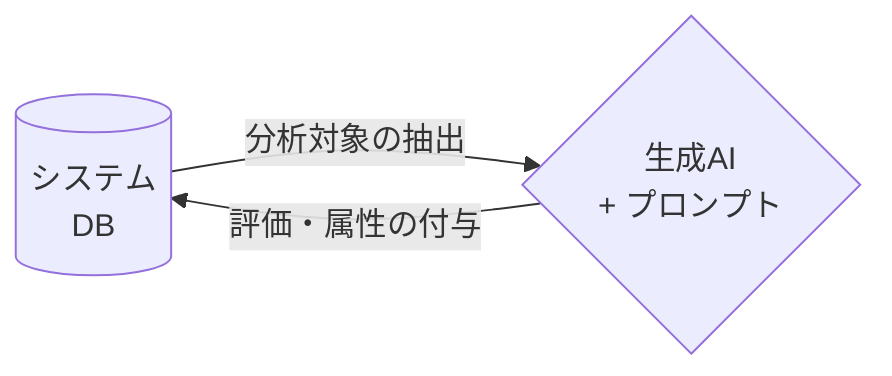
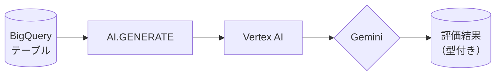
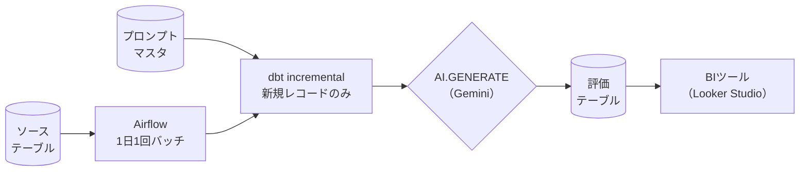

# BigQuery AI.GENERATE関数でDBのレコードを生成AIで評価

## 発表アウトライン v2（10分・20スライド構成）

---

## 1. カバースライド

**タイトル**：BigQuery AI.GENERATE関数でDBのレコードを生成AIで評価

---

## 2. 今日話すこと（アジェンダ）

**タイトル**：この10分でわかること

- AI.GENERATE関数とは
- 関数ファミリーとユースケース
- システムに組み込む際の設計ポイント
- 使ってみた感想

---

## 3. 問いかけ

**タイトル**：こんなニーズ、ありませんか？

- システムに溜まった大量のテキストデータ、どう扱っていますか？
- カスタマーレビューのネガポジを全件チェックしたい
- 検索クエリのインテントを自動分類したい
- 人手でのラベリングはもう限界

→ **「全レコードをGeminiで評価できたら？」**



---

## 4. AI.GENERATE とは

**タイトル**：BigQueryからVertex AI経由でGeminiを呼び出せる関数

**仕組み**：


**特徴**：
1. **SQLだけで完結** — データ移動なし。BigQueryの中で処理が完結する
2. **全件一括処理** — テーブルの全レコードをGeminiが1行ずつ評価
3. **型付き出力** — output_schemaでSTRUCT型として受け取れるので後続処理がシンプル

---

## 5. レビュー評価のサンプル（SQL）

**タイトル**：実際にやってみた — たったこれだけ

```sql
with base as (
    select
        text_column,
        ai.generate(
            'レビューから感情スコアと評価理由を分析して' || text_column,
            output_schema => 'score INT64, reason STRING'
        ) as ai_res
    from reviews
)

select text_column, ai_res.score, ai_res.reason
from base
```

SQLだけで完結。外部APIコール・Pythonスクリプト不要。

---

## 6. レビュー評価のサンプル（結果）

**タイトル**：こんな結果が得られる

| レビュー文 | score | reason |
|---|---|---|
| 「デザインが非常に洗練されていて…初期設定に少し時間がかかったのが残念です。」 | 80 | デザインは高評価だが、セットアップの難易度がマイナス要因 |
| 「注文してから届くまでが遅すぎます…二度と利用しません。」 | 15 | 配送遅延・梱包の不満、リピート意向も低い |
| 「コスパ最高です！この価格でこの機能性は文句なし。」 | 95 | 価格・機能・操作性すべてにポジティブな評価 |

非構造化テキストが、型付きの構造化データになる。

---

## 7. output_schema の威力

**タイトル**：型付きの構造化出力が得られる

**従来（ML.GENERATE_TEXT）**：
- 出力は固定のJSON文字列
- 型が不確定 → パース処理が必要

**新しい（AI.GENERATE）**：
```sql
AI.GENERATE(
  prompt,
  output_schema => 'sentiment STRING, score INT64, tags ARRAY<STRING>'
)
```
→ 指定した型のSTRUCTで返ってくる

**対応型**：STRING、INT64、FLOAT64、BOOL、ARRAY、STRUCT

---

## 8. モデルの選び方

**タイトル**：Geminiモデルはどれを選ぶ？

| モデル | 精度 | コスト | 速度 | おすすめ用途 |
|---|---|---|---|---|
| gemini-2.0-pro | ◎ | 高 | 遅い | 複雑な推論が必要な場合 |
| gemini-2.0-flash | ◯ | 中 | 速い | バランス重視 |
| **gemini-2.0-flash-lite-001** | △〜◯ | **低** | **速い** | **通常の分類・ラベリング** |

**結論**：分類・ラベリング用途なら Flash Lite で十分。コスパ◎

---

## 9. BIでこんな表現が可能

**タイトル**：ラベリング後のデータをBIに繋げると

```html
<div class="mermaid">
flowchart LR
    TXT[/テキスト 非構造化/]
    AI{AI.GENERATE}
    TBL[(評価テーブル score列など)]
    BI[BIツール Looker Studio]
    TXT --> AI --> TBL --> BI
</div>

<div class="mermaid" style="width: 60%; margin: 0 auto;">
%%{init: {'themeVariables': {'xyChart': {'plotColorPalette': '#E85C4C'}}}}%%
xychart-beta
    title "ネガティブレビュー比率（月次推移）"
    x-axis ["1月", "2月", "3月", "4月", "5月", "6月"]
    y-axis "ネガ率 (%)" 0 --> 50
    line [20, 30, 16, 39, 13, 10]
</div>
```

- 生成AIが「非構造化テキスト」を「通常のディメンション」に変換
- 4月の急増を**数値で即検知**できる（「なんとなく悪い気がする」から脱却）

---

## 11. 関数ファミリー紹介

**タイトル**：目的別に使い分けるAI関数

**汎用**

| 関数 | 用途 | 特徴 |
|---|---|---|
| **AI.GENERATE** | 要約・翻訳・抽出・分類 | output_schema で型指定。**主役** |
| AI.GENERATE_TEXT | テーブル→テーブルの一括生成 | Claude等パートナーモデルも利用可 |
| AI.GENERATE_TABLE | 複数項目の構造化抽出 | 第三引数でスキーマ指定 |
| AI.GENERATE_BOOL/DOUBLE/INT | 型を絞った生成 | シンプルに書ける |

**マネージド（軽量・高速）**

| 関数 | 用途 | 特徴 |
|---|---|---|
| AI.IF | 条件フィルタ | WHERE / JOIN に直書き可 |
| AI.SCORE | スコアリング | 内部でプロンプト最適化あり |
| AI.CLASSIFY | カテゴリ分類 | ラベルリストを渡すだけ |

**エンベディング・検索**

| 関数 | 用途 |
|---|---|
| AI.EMBED | テキスト/画像→ベクトル生成 |
| AI.SIMILARITY | 2入力間の類似度スコア |
| AI.SEARCH | セマンティック検索 |

**選び方**：自由なプロンプト → AI.GENERATE、決まったカテゴリ → AI.CLASSIFY、WHERE条件 → AI.IF

---

## 12. ユースケース①：レビュー感情分析

**タイトル**：全レコードに感情分析スコアを付与

```sql
SELECT
  review_id,
  AI.GENERATE(
    CONCAT('このレビューの感情を分析してください: ', review_text),
    output_schema => 'sentiment STRING, confidence_score FLOAT64, key_points ARRAY<STRING>',
    endpoint => 'gemini-2.0-flash-lite-001'
  ).*
FROM customer_reviews
WHERE analyzed_at IS NULL  -- 未分析のみ
```

**活用**：sentiment列でLooker Studioのグラフを分類。ネガティブ急増を即検知。

---

## 13. ユースケース②：異常コメント抽出

**タイトル**：スパム・不適切コメントをGeminiで自動検出

```sql
SELECT
  comment_id,
  comment_text,
  AI.GENERATE(
    CONCAT('このコメントがスパム・誹謗中傷・不適切な内容かどうか判定してください: ', comment_text),
    output_schema => 'is_anomalous BOOL, reason STRING, severity INT64',
    endpoint => 'gemini-2.0-flash-lite-001'
  ) AS detection
FROM user_comments
WHERE reviewed_at IS NULL  -- 未チェックのみ
```

**活用**：is_anomalous=trueのコメントを自動抽出してモデレーションキューに投入。severity列でBIの優先度表示にも活用。

---

## 15. システム設計：全体像

**タイトル**：dbt + Airflow でデータパイプラインに組み込む



責務を分離することで、評価項目の追加・変更がテーブル操作だけで完結する。

---

## 16. システム設計：増分更新でコスト削減

**タイトル**：評価済みはスキップする設計が命

- AI.GENERATEはトークン課金 — 全件再実行すると費用が跳ね上がる
- **既に評価済みのレコードはスキップ**、新規分だけ実行する増分設計が必須
- dbtのincrementalモデルやBigQueryのWHERE句で実現できる

**実装の考え方**：
- 評価テーブルに結果が存在するレコードは処理対象から除外
- Airflowで1日1回バッチ実行するだけでコストを最小化

---

## 17. システム設計：プロンプト管理テーブル

**タイトル**：プロンプトをSQLにハードコードしない

**よくあるNG設計**：
```sql
-- プロンプトがSQL内にベタ書き → 変更のたびにSQL修正が必要
AI.GENERATE('このレビューの感情を判定してください...（長い指示）', ...)
```

**推奨設計**：
```sql
-- プロンプトをマスタテーブルから取得
AI.GENERATE(p.prompt_text || review_text, ...)
FROM reviews r
JOIN prompt_master p ON p.task_type = 'sentiment_analysis'
```

**メリット**：評価項目の追加・プロンプトの改善がテーブル変更だけで完結。

---

## 18. システム設計：コスト・品質管理

**タイトル**：運用に乗せるための注意点

**コスト管理**：
- BigQueryスキャン料 ＋ Vertex AI利用料の合算 → 別々に見えてトラッキングしにくい
- `INFORMATION_SCHEMA` + ラベル管理で監視設計が必要
- Provisioned Throughput で安定化も選択肢

**品質管理**：
- AIの出力には表記ゆれが発生 → dbtで正規化ロジックを後続に組む
- 全レコードが完璧に分類されるわけではない → **Null許容設計が前提**
- プロンプトは「指示・フォーマット・判断基準」の3点セットで書く

---

## 19. 使ってみた感想

**タイトル**：実際に触れてみて

**よかった**：
- SQLだけで完結。Pythonスクリプト不要
- output_schemaで型付き出力が想像以上に便利
- Flash Liteでも分類精度は十分実用的

**ハマった**：
- プロンプトが甘いと出力がブレる → 3点セット（指示・フォーマット・判断基準）が必要
- コストのトラッキングがわかりにくい（BigQueryとVertex AIで別々に見える）
- 増分更新を最初から設計しておかないと後で痛い目を見る

---

## 20. まとめ

**タイトル**：SQLで全レコードをGeminiで評価できる時代に

**BigQuery AI.GENERATEのメリット**：
- SQLだけで全レコード評価可能
- データ移動なしでセキュア
- 型指定で後続のBI処理が容易
- dbt + Airflowでパイプライン化できる

**成功の3鉄則**：
> 1. **増分更新** — 評価済みはスキップしてコスト削減
> 2. **プロンプト管理の分離** — マスタテーブルで一元管理
> 3. **欠損の許容** — AIが判定できないケースを設計に織り込む

**「BigQuery AI.GENERATE、使ってみませんか？」**

---

## 参考資料

- [AI.GENERATE function](https://cloud.google.com/bigquery/docs/reference/standard-sql/bigqueryml-syntax-ai-generate)
- [AI.GENERATE_TEXT function](https://cloud.google.com/bigquery/docs/reference/standard-sql/bigqueryml-syntax-ai-generate-text)
- [Generative AI overview in BigQuery](https://cloud.google.com/bigquery/docs/generative-ai-overview)
- NRIネットコム Tech Blog: BigQueryの新関数 AI.GENERATE の検証
